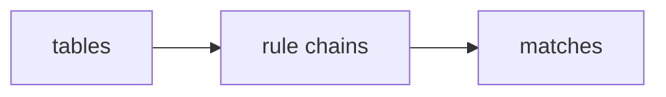

After sacrificing a few hours in the quest of finding the optimal bare-metal k8s setup for a project I am working on (more on that on a different blog post), I found myself jumping into the rabbit hole of some exotic networking patterns used in modern Kubernetes load balancing. According to a post from [Dynatrace](https://www.dynatrace.com/news/blog/kubernetes-in-the-wild-2023/#:~:text=A%20typical%20cluster%20running%20in,reflects%20economic%20and%20technical%20considerations.) "a typical cluster running in the public cloud consists of 5 relatively small nodes with just 16 to 32 GB of memory each. In comparison, on-premises clusters have more and larger nodes: on average, 9 nodes with 32 to 64 GB of memory." So, when I remembered that kube-proxy added support for IPVS starting version 1.8 and GA in 1.11 my secondary reaction was doubt. Probably my initial was indifference, because when k8s 1.8 was current, I didn't know much about Kubernetes. Or networks. Or computers to be honest. 

Despite my late blooming into the computing industry, I now know that there are probably a handful of organizations in the world that would benefit from lower computational complexity. Where I could see benefit for more people was the fact that IPVS was designed inherently as a load balancer so the availability of scheduling algorithms is broader. The randomized, equal-cost selection of iptables when redirecting traffic is, indeed, suboptimal. 

### A bit of iptables and IPVS history

Netfilter is the original Linux kernel's packet processing system. The commonplace name `iptables` came from the command that is used to interact with it, and because of their extremely tight coupling, and `iptables` being one of the most used commands in network computing, I'll refer to both as `iptables`, even when talking about the Netfilter framework. The architecture of `iptables` groups network packet processing rules into tables by function (e.g packet filtering, NAT, and other packet mangling), each of which have chains of processing rules that consist of matches. 

Examining it in reverse, the matches are used to determine which packets the rule will apply to and targets determine what will be done with the matching packets. 

    <h2>INPUT Chain Traversal</h2>
    

        

            
Rule 1: -p tcp --dport 22 (SSH)

            

        

        

            
Rule 2: -p tcp --dport 80 (HTTP)

            

        

        
Default Policy: ACCEPT

    

    
Packet (Dest: 80)

    <button onclick="startAnimation()">Run Packet</button>

The way kube-proxy leverages `iptables` is by attaching rules to the `NAT PREROUTING` chain to implement its load balancing. This is quite simple and uses what is now a very mature kernel feature, working in tandem with the vast majority of networking infrastructure software that also rely on `iptables` for filtering (think CNIs, firewalls, etc).

However, the way kube-proxy is forced to program the `NAT PREROUTING` chain is suboptimal. Nominally, it is an O(n) operation to traverse the chain, where n is the number of rules in the chain. What's more, the chain grows linearly with the number of services (and subsequently the number of pods) in the cluster, leading to a linear increase in traversal time. 

---
IPVS managed to evade the loss of its original name by its user-space utility, `ipvsadm`. It was merged relatively late into the Linux kernel, entering mainline in 2.4.x. Designed specifically for load balancing, IPVS maintains a conntrack-like table of virtual connections and uses standard load balancing scheduling algorithms, offering three forwarding modes: NAT, direct routing and tunneling.

When a packet is received at the interface where a virtual service (VIP:port) is configured, if it belongs to that connection, it is forwarded to the stored backend. Otherwise, it picks a backend based on the scheduling algorithm and creates a new connection entry in the conntrack table so future packets stay pinned.

    <h2>IPVS Load Balancing: Round Robin (RR)</h2>
    

    <h3>LVS Director (VIP: 192.168.1.10:80)</h3>
    
Scheduler: Round Robin (RR)

    

    

    

        
Real Server 1

        
192.168.1.11

    

    

        
Real Server 2

        
192.168.1.12

    

    

Client Request

<button onclick="startAnimation()">Start IPVS Routing</button>

Rather than a list of sequential rules, it offers an optimized API and an optimized lookup routine. The result in kube-proxy is a nominal computation complexity of O(1). In most scenarios, its connection processing performance stays constant independent of the number of services in the cluster. One of the potential downsides if you're operating IPVS within a Kubernetes cluster is that it requires investigation as to whether it will behave as expected together with tools that rely on `iptables` packet filtering. 

### In the wild

So, nominally kube-proxy's connection processing performance is better in IPVS mode than in iptables mode. In practice, there are two key attributes you will likely care about when it comes to the performance of kube-proxy: 

- CPU usage: how does your host where your pods are scheduled perform, including userspace and kernel/system usage, across all the processes needed to support your microservices stack, including kube-proxy?
- Round-trip time: when your microservices call each other, how long does it take on average for the to send and receive requests and responses?

The best way to test this is launch a load generator client microservice pod on a dedicated node generating around 1000 requests per second to a Kubernetes service backend. Scaling up to 100,000 service backends and running the load tests on repeat, I was able to paint a picture of the performance of kube-proxy both in IPVS and iptables mode. 

    <h2>Kubernetes Service Routing Performance at Scale</h2>
    

        <label for="service-slider">Number of Services:</label>
        <input type="range" id="service-slider" min="10" max="10000" step="10" value="1000" oninput="updateAnimation()">
        <output for="service-slider" id="service-count">1000</output>
        
*10 Endpoints per Service. 1000 Requests/sec Client Load.

    

    

        

            <h3>IPTABLES Mode</h3>
            

                Routing requires traversing **large, sequential rule chains** (O(N) lookup time).
            

            

                

                    
                

            

        

        

            <h3>IPVS Mode</h3>
            

                Routing is based on **hash map lookups** in the connection table (O(1) lookup time).
            

            

                

                    
                

            

        

When considering round-trip response time it's important to note that the difference between connections and requests is persistency. Most of the time, microservices will use "keepalive" connections, where each connection is reused for multiple requests. This is important because most new connections require a three-way handshake (SYN, SYN-ACK, ACK), which in turn requires more processing within the kernel networking stack.

Nginx is everyone's goto for simulating networking applications so we used it and its default keepalive configuration to get a ratio of round-trip response time vs number of connections. The default max keepalive connections is 100, so we used that as our upper bound.

